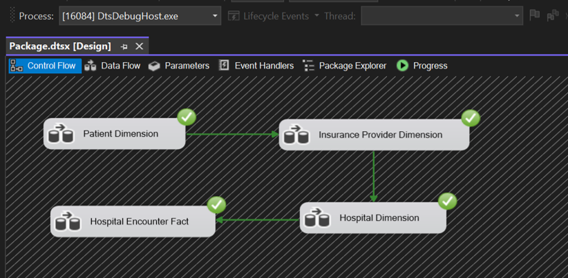

# 🏥 Healthcare Data Pipeline & Analytics

**Author:** Soumya Shah | [GitHub](https://github.com/SoumyaShahh)

An end-to-end healthcare data engineering project — from raw patient data to a star schema data warehouse, SSIS ETL pipeline, and a 5-dashboard Power BI analytics platform — designed to deliver actionable insights to hospital administrators, clinicians, and insurance providers.

---

## 📌 Project Overview

This project processes **10,000 patient encounter records** across US hospitals and insurance providers. Raw Excel data is ingested through an ETL pipeline into a structured SQL Server data warehouse, then surfaced through interactive Power BI dashboards covering doctor performance, billing trends, patient demographics, and insurance analytics.

**Who benefits:**
- 🏥 **Hospital Administrators** — optimize doctor workloads and capacity planning
- 👨‍⚕️ **Clinicians** — identify treatment effectiveness by doctor and condition
- 💰 **Insurance Providers** — analyze payment patterns and plan contributions
- 🏛️ **Policy Makers** — identify city-level medical hotspots for preventative planning

---

## 🏗️ Architecture

```
┌──────────────────────────────────────────────────────────────────┐
│                        Data Pipeline                             │
│                                                                  │
│   ┌─────────────┐     ┌──────────────────┐    ┌─────────────┐   │
│   │  Raw Data   │     │    SSIS ETL      │    │ SQL Server  │   │
│   │  (Excel)    │────▶│  Control Flow +  │───▶│    Data     │   │
│   │  10K rows   │     │   Data Flow      │    │  Warehouse  │   │
│   └─────────────┘     └──────────────────┘    └──────┬──────┘   │
│                                                       │          │
│                           Star Schema                 ▼          │
│   ┌───────────────────────────────────────────────────────────┐  │
│   │                   Data Warehouse                          │  │
│   │                                                           │  │
│   │  DimPatient          HospitalEncounterFact (Fact Table)   │  │
│   │  - PatientID    ◀───▶ - HospitalEncounterID (PK)         │  │
│   │  - Age               - PatientID (FK)                    │  │
│   │  - Gender            - HospitalID (FK)                   │  │
│   │  - BloodType         - InsuranceProviderID (FK)          │  │
│   │  - City/State        - BillingAmount                     │  │
│   │                      - LengthOfStay                      │  │
│   │  DimHospital    ◀───▶ - AmountPaid                       │  │
│   │  - HospitalID        - AmountOwed                        │  │
│   │  - Name              - MedicationResult                  │  │
│   │  - Type                                                   │  │
│   │                                                           │  │
│   │  DimInsuranceProvider                                     │  │
│   │  - InsuranceProviderID                                    │  │
│   │  - Provider / Plan / Coverage                             │  │
│   └───────────────────────────────────────────────────────────┘  │
│                              │                                    │
│                              ▼                                    │
│             ┌─────────────────────────────────┐                  │
│             │       Power BI Dashboards        │                  │
│             │  Doctor Performance              │                  │
│             │  Patient Distribution            │                  │
│             │  Billing & Volume Trends         │                  │
│             │  Insurance Payment Analytics     │                  │
│             │  Patient Demographics & Outcomes │                  │
│             └─────────────────────────────────┘                  │
└──────────────────────────────────────────────────────────────────┘
```

---

## 🛠️ Tech Stack

| Layer | Technology |
|---|---|
| Data Source | Microsoft Excel (10,000 patient records) |
| ETL Pipeline | SSIS (SQL Server Integration Services) |
| Data Warehouse | SQL Server (Star Schema) |
| Schema Design | Microsoft Visio |
| Query Layer | SQL Server Management Studio (SSMS) |
| Analytics & BI | Power BI Desktop (DAX, Power Query) |
| Predictive Modeling | Linear Regression |

---

## 📊 Dataset

**10,000 patient encounter records** with 24 fields:

| Category | Fields |
|---|---|
| Patient | Name, Age, Gender, Blood Type, City, State |
| Medical | Medical Condition, Admission Type, Medication, Medication Result |
| Hospital | Hospital Name, Hospital Type, Doctor, Doctor Experience, Room Number |
| Financial | Billing Amount, Amount Paid, Amount Owed |
| Insurance | Insurance Provider, Insurance Plan, Insurance Coverage |
| Time | Date of Admission, Discharge Date, Length of Stay |

**Conditions covered:** Cancer, Arthritis, Diabetes, Hypertension, Obesity, Asthma

**Insurance providers:** Aetna, Cigna, Blue Cross, UnitedHealth, Medicare, Humana

---

## ⚙️ ETL Pipeline — SSIS



```
Excel Source
    │
    ▼
Data Cleaning & Preprocessing
    │  • Null value handling
    │  • Date format standardization
    │  • Text field normalization
    ▼
Outlier Detection
    │  • Billing anomaly flagging
    │  • Unusual length of stay detection
    ▼
Data Transformation
    │  • One-hot encoding for Admission Type
    │  • Normalization of Length of Stay
    │  • Derived column: AmountOwed = BillingAmount - AmountPaid
    ▼
Load → SQL Server Data Warehouse
    ├── DimPatient
    ├── DimHospital
    ├── DimInsuranceProvider
    └── HospitalEncounterFact
```

---

## 📊 Power BI Dashboards

### Dashboard 1 — Doctor Performance & Cost Analysis


Ranks doctors by **patient recovery ratio** and analyzes cost-efficiency per physician — enables identification of top performers and informs resource allocation decisions.

---

### Dashboard 2 — Patient Distribution by City & Condition


Geographic heatmap of patient load across US cities with breakdown by medical condition and age range — identifies regional health trends and infrastructure needs.

---

### Dashboard 3 — Patient Demographics & Hospital Outcomes


Medical condition prevalence by hospital segmented by blood type and gender — enables targeted treatment strategies and outcome-driven resource allocation.

---

### Dashboard 4 — Billing & Volume Trends


Monthly billing vs. patient volume trends with Average Length of Stay tracking — identifies seasonal peaks and operational efficiency patterns.

---

### Dashboard 5 — Insurance Payment Analytics


Comparative analysis of patient vs. insurance provider payment contributions with plan-level treemap — directly informs insurance negotiation strategies.

---

## 🤖 Predictive Modeling

Regression models trained on 10,000 patient records to predict two key operational metrics:

| Target Variable | Business Value |
|---|---|
| **Billing Amount** | Helps patients estimate costs before admission; supports hospital revenue forecasting |
| **Length of Stay** | Enables bed capacity planning; identifies inefficiencies in patient throughput |

**Features used:** Age, Medical Condition, Admission Type, Doctor Experience, Hospital Type, Insurance Coverage, Blood Type

---

## 💡 Key Business Insights

| Insight | Impact |
|---|---|
| Significant variation in doctor recovery rates | Enables targeted coaching and best practice replication |
| City-level condition hotspots identified | Supports targeted infrastructure and policy planning |
| Insurance payment contributions vary by plan | Directly informs negotiation strategies with providers |
| Predictable seasonal patient volume peaks | Enables proactive staffing and resource allocation |
| Cancer and chronic conditions drive highest billing | Informs insurance plan design and cost management |

---

## 🎯 Business Implications

**Doctor Reputation & Patient Outcomes**
- Enables administrators to identify top-performing doctors and optimize workload distribution
- Helps patients select doctors based on recovery rates and treatment outcomes

**Revenue & Billing Optimization**
- Enables patients to estimate billing costs based on condition and insurance coverage
- Gives hospital management revenue insights segmented by condition and demographics

**City-Level Medical Condition Hotspots**
- Identifies geographic hotspots for specific medical conditions
- Empowers policymakers to design targeted preventative care initiatives
- Supports hospital infrastructure and capacity planning by condition type

**Insurance Provider Analysis**
- Provides insurance providers expense visibility by location and condition
- Directly informs the design of competitive and targeted healthcare plans

**Resource Planning**
- Patient volume trends reveal seasonal patterns for proactive resource planning
- Seasonal variations inform staffing, financial planning, and operational efficiency

---

## 📁 Repository Structure

```
Healthcare-Analysis/
├── screenshots/
│   ├── Dashboard 1.png    # Doctor Performance
│   ├── Dashboard 2.png    # Patient Distribution
│   ├── Dashboard 3.png    # Patient Demographics
│   ├── Dashboard 4.png    # Billing Trends
│   ├── Dashboard 5.png    # Insurance Analytics
│   └── etl.png            # SSIS ETL Pipeline
├── healthcare_dataset.xlsx   # Source dataset (10,000 records)
├── Healthcare-Analysis.pptx  # Full project presentation
└── README.md
```

---

*Built by Soumya Shah | [GitHub](https://github.com/SoumyaShahh)*
